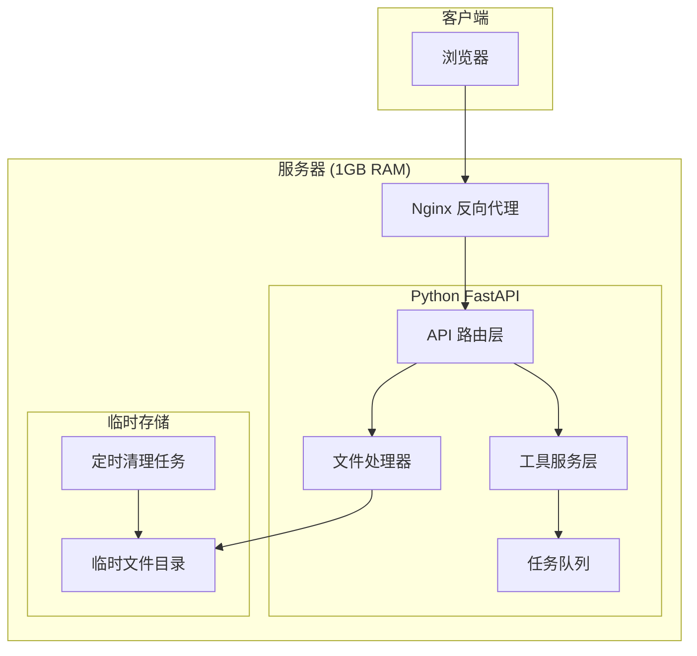
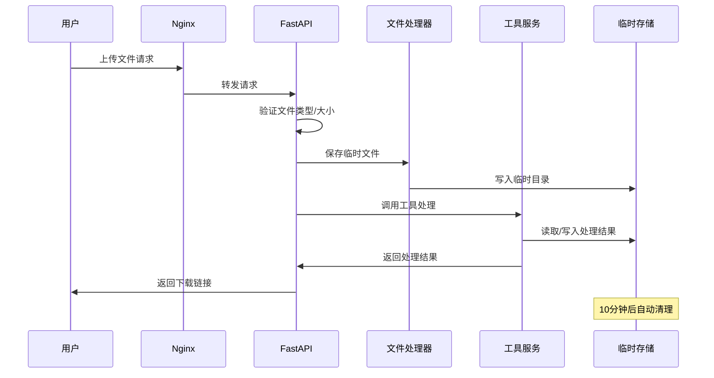

# Design Document

## Overview

本设计文档描述在线工具平台的技术架构和实现方案。平台采用前后端分离架构，后端使用 Python (FastAPI) 处理文件和工具逻辑，前端使用轻量级方案（HTML + Vanilla JS + Tailwind CSS）确保 SEO 友好和快速加载。系统设计目标是在 1GB 内存服务器上稳定运行，支持 PDF 处理、图像处理、文本工具和开发者工具四大类功能。

## Architecture

### 系统架构图



### 请求处理流程



## Components and Interfaces

### 1. API 路由层 (api/)

负责处理 HTTP 请求，路由到对应的工具服务。

```python
# 路由结构
/api/v1/
├── pdf/
│   ├── compress      # PDF 压缩
│   ├── to-word       # PDF 转 Word
│   ├── merge         # PDF 合并
│   ├── split         # PDF 拆分
│   └── from-images   # 图片转 PDF
├── image/
│   ├── compress      # 图片压缩
│   ├── compress-to-size  # 指定大小压缩
│   ├── convert       # 格式转换
│   ├── crop          # 裁剪
│   ├── grid-split    # 行列切割
│   ├── split-compress # 切割并压缩
│   └── to-ico        # ICO 生成
├── text/
│   ├── json-format   # JSON 格式化
│   ├── base64        # Base64 编解码
│   ├── regex-test    # 正则测试
│   └── markdown      # Markdown 转 HTML
└── dev/
    ├── jwt-decode    # JWT 解码
    ├── cron-generate # Cron 生成
    ├── uuid          # UUID 生成
    └── ip-lookup     # IP 查询
```

### 2. 文件处理器 (core/file_handler.py)

```python
class FileHandler:
    """文件上传、验证和临时存储管理"""
    
    async def validate_file(self, file: UploadFile, allowed_types: list[str], max_size: int) -> ValidationResult:
        """通过文件内容验证类型，检查大小限制"""
        pass
    
    async def save_temp_file(self, file: UploadFile) -> TempFile:
        """保存到临时目录，返回文件路径和唯一ID"""
        pass
    
    async def get_temp_file(self, file_id: str) -> Path:
        """获取临时文件路径"""
        pass
    
    async def cleanup_expired(self) -> int:
        """清理超过10分钟的临时文件"""
        pass
```

### 3. 工具服务层 (services/)

#### PDF 服务 (services/pdf_service.py)

```python
class PDFService:
    async def compress(self, input_path: Path, quality: int = 70) -> Path:
        """压缩 PDF，目标压缩率 30%+"""
        pass
    
    async def to_word(self, input_path: Path) -> Path:
        """PDF 转 Word (DOCX)"""
        pass
    
    async def merge(self, input_paths: list[Path], order: list[int]) -> Path:
        """合并多个 PDF"""
        pass
    
    async def split(self, input_path: Path, page_ranges: list[tuple[int, int]]) -> list[Path]:
        """按页码范围拆分 PDF"""
        pass
    
    async def from_images(self, image_paths: list[Path]) -> Path:
        """图片转 PDF"""
        pass
```

#### 图像服务 (services/image_service.py)

```python
class ImageService:
    async def compress(self, input_path: Path, quality: int = 80) -> Path:
        """压缩图片，保持 80%+ 视觉质量"""
        pass
    
    async def compress_to_size(self, input_path: Path, target_size_kb: int) -> Path:
        """压缩到指定文件大小"""
        pass
    
    async def convert(self, input_path: Path, target_format: str) -> Path:
        """格式转换 (WebP -> JPG 等)"""
        pass
    
    async def crop(self, input_path: Path, x: int, y: int, width: int, height: int) -> Path:
        """裁剪图片"""
        pass
    
    async def grid_split(self, input_path: Path, rows: int, cols: int, 
                         row_positions: list[float], col_positions: list[float]) -> list[Path]:
        """按行列切割，positions 为 0-1 的相对位置"""
        pass
    
    async def split_and_compress(self, input_path: Path, rows: int, cols: int,
                                  row_positions: list[float], col_positions: list[float],
                                  target_size_kb: int) -> list[Path]:
        """切割并压缩每个区块"""
        pass
    
    async def to_ico(self, input_path: Path, sizes: list[int] = [16, 32, 48, 256]) -> Path:
        """生成 ICO 文件"""
        pass
```

#### 文本服务 (services/text_service.py)

```python
class TextService:
    def format_json(self, json_str: str, indent: int = 2) -> FormatResult:
        """格式化 JSON，返回结果或错误位置"""
        pass
    
    def base64_encode(self, text: str) -> str:
        """Base64 编码"""
        pass
    
    def base64_decode(self, encoded: str) -> str:
        """Base64 解码"""
        pass
    
    def test_regex(self, pattern: str, test_string: str) -> RegexResult:
        """正则测试，返回匹配和分组"""
        pass
    
    def markdown_to_html(self, markdown: str) -> str:
        """Markdown 转 HTML"""
        pass
```

#### 开发者工具服务 (services/dev_service.py)

```python
class DevService:
    def decode_jwt(self, token: str) -> JWTResult:
        """解码 JWT，返回 header、payload、签名状态"""
        pass
    
    def generate_cron(self, minute: str, hour: str, day: str, 
                      month: str, weekday: str) -> CronResult:
        """生成 cron 表达式，计算下次执行时间"""
        pass
    
    def generate_uuid(self) -> str:
        """生成 UUID v4"""
        pass
    
    async def lookup_ip(self, ip: str) -> IPInfo:
        """查询 IP 地理位置和 ISP"""
        pass
```

### 4. 任务队列 (core/task_queue.py)

```python
class TaskQueue:
    """简单的内存任务队列，限制并发处理数"""
    
    def __init__(self, max_concurrent: int = 3):
        self.semaphore = asyncio.Semaphore(max_concurrent)
    
    async def submit(self, task: Callable) -> Any:
        """提交任务，超过并发限制时排队等待"""
        async with self.semaphore:
            return await task()
```

### 5. 前端页面 (static/)

```
static/
├── index.html          # 首页，工具导航
├── css/
│   └── style.css       # Tailwind CSS 构建输出
├── js/
│   ├── common.js       # 公共功能（文件上传、下载）
│   ├── image-grid.js   # 图片切割拖拽交互
│   └── tools/          # 各工具页面脚本
├── tools/
│   ├── pdf/
│   │   ├── compress.html
│   │   ├── to-word.html
│   │   ├── merge.html
│   │   ├── split.html
│   │   └── from-images.html
│   ├── image/
│   │   ├── compress.html
│   │   ├── compress-to-size.html
│   │   ├── convert.html
│   │   ├── crop.html
│   │   ├── grid-split.html
│   │   ├── split-compress.html
│   │   └── to-ico.html
│   ├── text/
│   │   ├── json-format.html
│   │   ├── base64.html
│   │   ├── regex-test.html
│   │   └── markdown.html
│   └── dev/
│       ├── jwt-decode.html
│       ├── cron-generate.html
│       ├── uuid.html
│       └── ip-lookup.html
└── sitemap.xml
```

## Data Models

### 请求/响应模型

```python
from pydantic import BaseModel
from typing import Optional
from enum import Enum

class FileUploadResponse(BaseModel):
    file_id: str
    filename: str
    size: int
    expires_at: datetime

class ProcessingResult(BaseModel):
    success: bool
    download_url: Optional[str]
    error_message: Optional[str]
    processing_time_ms: int

class GridSplitRequest(BaseModel):
    file_id: str
    rows: int  # 行数
    cols: int  # 列数
    row_positions: list[float]  # 行切割位置 (0-1)
    col_positions: list[float]  # 列切割位置 (0-1)
    compress_to_size_kb: Optional[int]  # 可选：压缩目标大小

class GridSplitResponse(BaseModel):
    success: bool
    download_urls: list[str]  # 各区块下载链接
    grid_info: list[dict]  # 各区块信息 (row, col, width, height)

class ValidationResult(BaseModel):
    valid: bool
    detected_type: Optional[str]
    error_message: Optional[str]

class FormatResult(BaseModel):
    success: bool
    formatted: Optional[str]
    error_line: Optional[int]
    error_column: Optional[int]
    error_message: Optional[str]

class RegexResult(BaseModel):
    matches: list[dict]  # [{start, end, text, groups}]
    match_count: int

class JWTResult(BaseModel):
    header: dict
    payload: dict
    signature_valid: Optional[bool]
    expired: bool
    error_message: Optional[str]

class CronResult(BaseModel):
    expression: str
    description: str
    next_runs: list[datetime]  # 接下来5次执行时间

class IPInfo(BaseModel):
    ip: str
    country: str
    region: str
    city: str
    isp: str
    timezone: str
```

### 临时文件模型

```python
class TempFile(BaseModel):
    id: str
    original_name: str
    path: Path
    size: int
    mime_type: str
    created_at: datetime
    expires_at: datetime
```


## Correctness Properties

*A property is a characteristic or behavior that should hold true across all valid executions of a system-essentially, a formal statement about what the system should do. Properties serve as the bridge between human-readable specifications and machine-verifiable correctness guarantees.*

### PDF 工具属性

**Property 1: PDF 压缩有效性**
*For any* valid PDF file, compressing it SHALL produce an output file that is at least 30% smaller than the input while remaining a valid PDF.
**Validates: Requirements 1.1**

**Property 2: PDF 转 Word 有效性**
*For any* valid PDF file, converting it to Word SHALL produce a valid DOCX file that can be opened by document processors.
**Validates: Requirements 1.2**

**Property 3: PDF 合并完整性**
*For any* list of valid PDF files and any specified order, merging them SHALL produce a single PDF where the total page count equals the sum of all input page counts.
**Validates: Requirements 1.3**

**Property 4: PDF 拆分正确性**
*For any* valid PDF and any valid page range selection, splitting SHALL produce separate PDF files where each contains exactly the specified pages.
**Validates: Requirements 1.4**

**Property 5: 图片转 PDF 完整性**
*For any* list of valid images, converting to PDF SHALL produce a PDF with page count equal to the number of input images.
**Validates: Requirements 1.5**

### 图像工具属性

**Property 6: 指定大小压缩**
*For any* valid image and any target size in KB, compressing to that size SHALL produce an output file with size less than or equal to the target.
**Validates: Requirements 2.2**

**Property 7: 格式转换有效性**
*For any* valid WebP image, converting to JPG SHALL produce a valid JPG file that can be decoded by image libraries.
**Validates: Requirements 2.3**

**Property 8: 裁剪尺寸正确性**
*For any* valid image and any valid crop dimensions (x, y, width, height within bounds), cropping SHALL produce an image with exactly the specified width and height.
**Validates: Requirements 2.4**

**Property 9: 网格切割数量正确性**
*For any* valid image and grid configuration of R rows and C columns, grid splitting SHALL produce exactly R × C separate image files.
**Validates: Requirements 2.7**

**Property 10: 切割并压缩组合正确性**
*For any* valid image, grid configuration, and target size, split-and-compress SHALL produce R × C images where each image's file size is at or below the target size.
**Validates: Requirements 2.8**

**Property 11: ICO 生成有效性**
*For any* valid image input, ICO generation SHALL produce a valid ICO file containing the standard icon dimensions.
**Validates: Requirements 2.9**

### 文本工具属性

**Property 12: JSON 格式化往返一致性**
*For any* valid JSON string, formatting it and then parsing the result SHALL produce data equivalent to parsing the original string.
**Validates: Requirements 3.1**

**Property 13: Base64 编解码往返一致性**
*For any* text string, encoding to Base64 and then decoding SHALL return the original text exactly.
**Validates: Requirements 3.2, 3.3**

**Property 14: 正则匹配正确性**
*For any* valid regex pattern and test string, the returned matches SHALL be identical to Python's re.findall() results.
**Validates: Requirements 3.4**

**Property 15: Markdown 转换有效性**
*For any* Markdown text, converting to HTML SHALL produce valid, parseable HTML.
**Validates: Requirements 3.5**

### 开发者工具属性

**Property 16: JWT 解码正确性**
*For any* valid JWT token, decoding SHALL correctly extract the header and payload that match the original encoded values.
**Validates: Requirements 4.1**

**Property 17: Cron 表达式有效性**
*For any* valid cron parameters, the generated expression SHALL be parseable by standard cron libraries and the next run times SHALL be chronologically ordered.
**Validates: Requirements 4.2**

**Property 18: UUID 格式有效性**
*For any* generated UUID, it SHALL conform to UUID v4 format (8-4-4-4-12 hex digits with version 4 indicator).
**Validates: Requirements 4.3**

### 文件安全属性

**Property 19: 文件类型检测准确性**
*For any* file with mismatched extension and actual content type, validation SHALL detect the true content type based on file magic bytes.
**Validates: Requirements 5.1**

### SEO 属性

**Property 20: 页面元数据完整性**
*For any* tool page, the rendered HTML SHALL contain a unique meta title, meta description, and canonical URL that differ from other tool pages.
**Validates: Requirements 7.1**

**Property 21: HTML 语义结构正确性**
*For any* tool page, the rendered HTML SHALL have exactly one h1 element and heading levels SHALL not skip (e.g., h1 followed by h3 without h2).
**Validates: Requirements 7.2**

## Error Handling

### 文件处理错误

| 错误场景 | HTTP 状态码 | 错误响应 |
|---------|------------|---------|
| 文件超过大小限制 | 413 | `{"error": "file_too_large", "max_size_mb": 10}` |
| 不支持的文件类型 | 415 | `{"error": "unsupported_type", "supported": ["pdf", "jpg", ...]}` |
| 文件内容与扩展名不匹配 | 400 | `{"error": "type_mismatch", "detected": "image/png", "claimed": "application/pdf"}` |
| 临时文件已过期 | 404 | `{"error": "file_expired", "message": "File has been deleted"}` |
| 处理超时 | 504 | `{"error": "processing_timeout", "timeout_seconds": 60}` |

### 工具处理错误

| 错误场景 | HTTP 状态码 | 错误响应 |
|---------|------------|---------|
| 无效 JSON 输入 | 400 | `{"error": "invalid_json", "line": 5, "column": 12, "message": "..."}` |
| 无效正则表达式 | 400 | `{"error": "invalid_regex", "message": "..."}` |
| 无效 JWT 格式 | 400 | `{"error": "invalid_jwt", "message": "..."}` |
| PDF 页码超出范围 | 400 | `{"error": "invalid_page_range", "total_pages": 10, "requested": [15, 20]}` |
| 裁剪尺寸超出图片边界 | 400 | `{"error": "crop_out_of_bounds", "image_size": [800, 600], "requested": {...}}` |

### 系统级错误

| 错误场景 | HTTP 状态码 | 错误响应 |
|---------|------------|---------|
| 请求频率超限 | 429 | `{"error": "rate_limited", "retry_after": 60}` |
| 服务器资源不足 | 503 | `{"error": "server_busy", "message": "Please try again later"}` |
| 并发处理队列已满 | 503 | `{"error": "queue_full", "position": 5}` |

## Testing Strategy

### 单元测试

使用 **pytest** 进行单元测试，覆盖：

- 各工具服务的核心逻辑
- 文件验证和类型检测
- 数据模型验证
- 错误处理路径

### 属性测试

使用 **Hypothesis** 进行属性测试，验证正确性属性：

```python
from hypothesis import given, strategies as st

# 示例：Base64 往返测试
@given(st.text())
def test_base64_roundtrip(text):
    """
    **Feature: online-tools-platform, Property 13: Base64 编解码往返一致性**
    """
    encoded = text_service.base64_encode(text)
    decoded = text_service.base64_decode(encoded)
    assert decoded == text
```

**属性测试配置：**
- 每个属性测试运行至少 100 次迭代
- 使用 Hypothesis 的 shrinking 功能定位最小失败用例
- 每个正确性属性对应一个独立的属性测试函数

### 集成测试

使用 **pytest** + **httpx** 进行 API 集成测试：

- 文件上传和下载流程
- 完整的工具处理流程
- 错误响应格式验证
- 并发请求处理

### 测试文件结构

```
tests/
├── unit/
│   ├── test_pdf_service.py
│   ├── test_image_service.py
│   ├── test_text_service.py
│   ├── test_dev_service.py
│   └── test_file_handler.py
├── property/
│   ├── test_pdf_properties.py
│   ├── test_image_properties.py
│   ├── test_text_properties.py
│   └── test_dev_properties.py
└── integration/
    ├── test_api_pdf.py
    ├── test_api_image.py
    ├── test_api_text.py
    └── test_api_dev.py
```

## Dependencies

### Python 依赖

```
# Web 框架
fastapi>=0.104.0
uvicorn>=0.24.0
python-multipart>=0.0.6

# PDF 处理
pypdf>=3.17.0
pdf2docx>=0.5.6
img2pdf>=0.5.1

# 图像处理
pillow>=10.1.0

# 文本处理
markdown>=3.5.0
python-jose>=3.3.0  # JWT

# 工具
python-magic>=0.4.27  # 文件类型检测
croniter>=2.0.0  # Cron 解析
httpx>=0.25.0  # IP 查询

# 测试
pytest>=7.4.0
hypothesis>=6.92.0
pytest-asyncio>=0.21.0
```

### 系统依赖

- libmagic (文件类型检测)
- libjpeg, libpng, libwebp (图像处理)

## Deployment

### 服务器配置 (1GB RAM)

```nginx
# /etc/nginx/sites-available/tools
server {
    listen 80;
    server_name tools.example.com;
    
    # 静态文件
    location /static/ {
        alias /var/www/tools/static/;
        expires 7d;
    }
    
    # API 代理
    location /api/ {
        proxy_pass http://127.0.0.1:8000;
        proxy_set_header Host $host;
        client_max_body_size 10M;
    }
    
    # 工具页面
    location / {
        root /var/www/tools/static;
        try_files $uri $uri.html $uri/ =404;
    }
}
```

### 进程管理

```ini
# /etc/supervisor/conf.d/tools.conf
[program:tools]
command=/usr/bin/python -m uvicorn main:app --host 127.0.0.1 --port 8000 --workers 2
directory=/var/www/tools
user=www-data
autostart=true
autorestart=true
```

### 内存优化

- Uvicorn workers: 2 (每个约 150MB)
- 文件处理使用流式读写
- 临时文件 10 分钟自动清理
- 并发处理限制为 3 个任务
